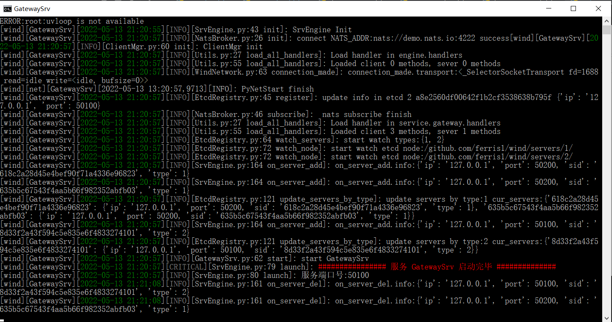

# wind

Wind是一款面向云的高性能、高效率以及高扩展性的大型分布式游戏服务器引擎。Wind利用Python语言的简洁语法以及丰富的生态库来提高游戏业务的开发效率，针对一些对性能有要求的游戏业务功能(如实时战斗功能)，Wind利用Golang的高并发特性来保证服务的高性能，同时Wind接入云的组件来保证游戏服务的动态扩展性，提高服务资源的利用率。

# 为什么存在

游戏界有Unity和Unreal这样完善并且开箱即用的客户端引擎，这样的引擎大大缩短了游戏的开发周期，基本上一天就能做一个能跑的游戏。但是却并不存在一款大家熟知分布式服务器引擎，这样的服务器引擎可以快速上手并且能满足游戏各个阶段的开发需求。Wind致力于做一款易上手且完善的分布式服务器引擎，帮助独立游戏开发者或者中小企业快速搭建服务器框架并且快速开发游戏业务，降低游戏服务器开发难度与成本。

# Wind特性
- [x] **游戏服务器界首次结合go与python优点的服务器**
- [x] **支持函数级别的热更新**
- [x] **利用Python简明的语法与丰富的生态库来编写业务量大的游戏业务逻辑，提升开发效率。**
- [x] **利用Golang来保证引擎底层功能或者实时性游戏业务的高性能。**
- [x] **方便的RPC使用流程，只需要在handlers_client/server目录下编写以handler_开头的函数就可自动注册。**
- [x] **使用单线程异步协程来处理并发消息，降低业务开发难度。**
- [x] **协议编码：支持Protobuf与Json编码。**
- [x] **网络层支持多网络协议：TCP，UDP与KCP。**
- [x] **使用etcd做服务发现，支持动态伸缩各类型服务。**
- [ ] **使用K8s动态配置、部署云服务资源，提升资源使用率。**
- [ ] **支持负载均衡算法：随机选取，最大阈值选取与最小阈值选取。**
- [ ] **多平台部署**


# Wind安装获取

- **安装Python**

Wind默认在Windows平台下开发，支持Linux下Docker部署。Wind业务逻辑使用Python编写，Golang编译成动态库供python调用，运行前需要安装Python版本，我的Python版本是3.9，支持Python3.5+。

Wind使用Etcd做服务发现功能，使用Nats做分布式消息队列，所以需要安装对应Python客户端库。在script目录下运行 **`install_python_requirements.bat`**  安装对应python库。

- **获取Wind代码**

```go
git clone https://github.com/ferris1/wind.git
```

- **启动单个服务**

在script下运行 `start_gateway.bat` 启动gateway服务


- **启动分布式服务**

启动分布式服务时需要保证运行Etcd服和Nats服，具体运行参考官网，要不然各个服务不能合作运行。

在script下运行 `start_all.bat` 启动所有服务，目前只有两类服务，一个是Gateway服务，用于消息路由，一个是Game服务，用于处理游戏逻辑。

Wind只是分布式服务器引擎，最终的分布式服务框架还需要你自己设计，具体可以参考这边文章[从服务器发展史看现代游戏服务器架构](https://zhuanlan.zhihu.com/p/500840594)

# Wind使用

Wind服务客户端请求非常简单，只需要两步。

- **协议定义**

目前客户端通信支持protobuf协议编码，在engine\codec\proto\rpc_client加与客户端通信的接口，比如加以下接口。

```protobuf
message PlayerLoginRequest
{
    string player_id = 1;
}

message PlayerLoginResponse
{
    string player_id = 1;
    bool result = 2;
}
```

- **RPC函数**

然后你只需要在对应服务的`handlers_client`下编写RPC函数，服务器启动时会自动注册RPC函数，然后就可以服务客户端请求了，比如Gateway服务下的`handler_player`

```python

import logging
from engine.codec.proto_importer import PlayerLoginResponse
from engine.client.ClientMgr import ClientConn

# 客户端rpc函数以Handler开头,后面接对应协议的函数名
async def Handler_PlayerLoginRequest(client: ClientConn, request):
    logging.info(f"player_id:{client}, request:{request} ")
    client.set_player_id(request.player_id)
    pck = PlayerLoginResponse()
    pck.player_id = request.player_id
    pck.result = True
    client.send_packet(pck)
```
# Exmaple
目前有个Python的小客户端


# 文档

[Wind文档](https://ferris1.gitbook.io/wind-yi-kuan-mian-xiang-yun-de-fen-bu-shi-you-xi-fu-wu-qi-yin-qing/)

[Wind设计文章](https://ferris1.gitbook.io/wind-yi-kuan-mian-xiang-yun-de-fen-bu-shi-you-xi-fu-wu-qi-yin-qing/)
